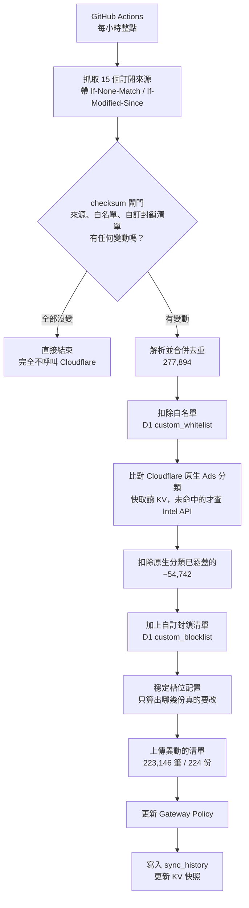

# cloudflare-gateway-block-ads 🛡️

> 用 Cloudflare Zero Trust Gateway 做全網域擋廣告與追蹤器。
> 不必多養一台 Pi-hole，不必在每台裝置上裝東西，換了網路也還在。

**cloudflare-gateway-block-ads** 把 15 個公開的廣告/追蹤器訂閱來源合併成一份去重後的
網域清單，扣掉 Cloudflare 內建分類已經涵蓋的部分，再上傳成 Cloudflare Gateway 的
DNS 封鎖清單。整套跑在 GitHub Actions 上，狀態存在 Cloudflare D1 與 KV，
**不需要任何伺服器**。

目前規模：15 個來源合併出 **277,894** 個網域，扣掉 **6** 個白名單網域與
**54,742** 個已被 Cloudflare 原生分類涵蓋的網域，實際上傳 **223,146** 個網域、
分佈在 **224 份** Gateway 清單。

## 目錄

- [為什麼這樣做](#為什麼這樣做)
- [運作方式](#運作方式)
- [安裝](#安裝)
- [日常操作](#日常操作)
- [即時觀測儀表板](#即時觀測儀表板)
- [疑難排解](#疑難排解)
- [參考資料](#參考資料)

## 為什麼這樣做

### 為什麼是 Gateway 清單，不是 Regex

Cloudflare 的 policy 表達式有 6,500 字元上限。同等規模的網域清單改用 Regex 表示，
需要的 policy 數量會遠超過用清單的做法（公開實測：144K 網域用 Regex 需要 499 條
policy，用清單只要 145 個）。規模一上來就完全不划算。

### 為什麼先讓 Cloudflare 原生分類擋一層

Cloudflare 自己的 Ads 分類（Advertisements + Trackers/Analytics）零維護、自動更新。
先讓它擋掉涵蓋範圍內的網域，我們只上傳它沒涵蓋到的部分 —— 目前這一步就省下
**54,742** 個網域，換到的是在 300 份清單的免費額度內留下更多空間。

> ⚠️ **「網域不在 Gateway 清單裡」不等於「沒被擋」。**
> 那 54,742 個網域是被原生分類擋掉、**刻意不上傳**的，`doubleclick.net` 就是其中之一。
> 只掃清單會得到「查無此網域」的錯誤結論。用 [`manage.sh find`](#診斷某個網域為什麼會或不會被擋)
> 才會把四個來源都查一遍。

### 為什麼 D1 不做即時查詢

DNS 查詢當下的封鎖判斷完全交給 Gateway 自己的清單機制。D1 只在排程同步時被讀寫，
避開「即時查詢外部資料庫、延遲不穩定」的問題。這也表示 D1 掛掉不影響封鎖，
只會讓同步暫時失敗。

### 為什麼 CNAME 分類維持預設

不開啟「忽略 CNAME 域名類別」，保留偵測「用第一方網域偽裝的廣告/追蹤器」的能力。
個案誤判交給白名單處理，不為了少數誤判犧牲整體防護力。

### 已知限制

| 限制 | 說明 |
|---|---|
| 只能做網域層級 | DNS 查詢看不到 URL 路徑，也看不到是哪個 App 發的。來源清單裡的 `\|\|domain.com/path` 或 `$app=` 這類條件會被忽略 |
| 命中即涵蓋子網域 | Gateway 的 DOMAIN 清單命中 `example.com` 時，`ads.example.com` 也會一起被擋。這是特性，也是誤擋的主要來源 |
| 不採用來源自帶的 `@@` 例外 | 交給本專案自己的白名單統一管理，避免不受控的破口 |
| 白名單預設精確比對 | `youtube.com` 不會放行 `ads.youtube.com`。要涵蓋子網域得寫 `*.youtube.com` |

## 運作方式



### 三個關鍵設計

#### 1. checksum 閘門：每小時檢查，但幾乎不做事

排程是每小時整點，但腳本會先比對**各來源解析後輸出**的 sha256。全部沒變動就直接結束，
一次 Cloudflare API 都不會呼叫。

比對的是「解析後輸出」而不是原始位元組，因為很多來源的檔頭帶有時間戳，
每次抓下來的原始內容都不一樣，用原始位元組算 checksum 會永遠都判定為「有變動」。

白名單與自訂封鎖清單的 checksum 也納入閘門 —— 否則你加了白名單卻不會觸發同步。

#### 2. 穩定槽位：移除一個網域只重傳一份清單

每份清單是一個**槽位**，不是連續切片：

| | 連續切片（舊） | 穩定槽位（現行） |
|---|---|---|
| 移除一個網域 | 它之後的每一份都位移一格，全部要重傳 | 只從它所在那份拿掉，留下空缺 |
| 新增一個網域 | 同上 | 優先遞補編號最小的空缺，填滿才開新的 |
| 實測（移除第 ~144,000 位的網域）| 重傳 80 份 / 76 秒 | 重傳 1 份 |
| 實測（新增 7 個網域）| — | 重傳 1 份 / 52 秒 |

成員資料每次都直接向 Cloudflare 讀回，**不另外存一份副本**。Gateway 上的實際內容
就是權威來源：能自我修復（有人手動改過也會被看見），而且同時涵蓋中斷續傳 ——
上次沒傳完的狀態，這次讀到的就是未完成實況，自然會把差額補上。

代價是清單內容會逐漸失去字母序。這對封鎖行為沒有影響，但表示不能再用二分搜尋
定位網域，要用 [`manage.sh find`](#診斷某個網域為什麼會或不會被擋)。

#### 3. 分類快取放 KV，不放 D1 的讀取路徑

`domain_category_cache` 有 46 萬列。原本每次同步都要 `SELECT ... WHERE checked_at >= ?`
把整張表讀出來 —— 這是一次全表掃描，實測讓單日 rowsRead 衝到 5,551,625，
超過 D1 免費版每日 500 萬列的上限。

> **這裡不該加索引。** 索引只在選擇性高、命中列數遠小於總數時才有效；
> 這個查詢在 TTL 內幾乎命中每一列，走索引要先掃 B-Tree 再回表，比全表掃描更貴，
> 而且每次寫入都要多維護一份索引結構（那些也算 Rows Written）。
> 問題不在「怎麼掃」，在於「不該把整張表讀出來」。

改成把快取整份存成 KV 上的一個 gzip blob，讀取時抓這一個物件就好：

| | 改動前 | 改動後 |
|---|---|---|
| 每次同步的 D1 讀取 | 462,890 列 | ≤ 約 136 列 |
| 快照大小 | — | 463,061 列 / 3.54 MiB（KV 單值上限 25 MiB）|

**KV 只是讀取側快取，D1 仍然是權威來源，寫入路徑沒有改變。** KV 回 404、非 200、
內容不是合法 gzip、解壓後是空的、任何一行不符三欄格式 —— 任何一種情況都會退回讀 D1，
所以最壞情況等同沒有這層快取。

> 「約 136 列」是從兩次強制同步的 D1 用量推算出來的**上界**，不是量測到的定值：
> D1 會把 UPSERT 造成的索引查找也算進 `rowsRead`，所以那個數字裡混著寫入端的成本。
> 而且兩次都是強制完整同步，不代表更常見的「checksum 閘門直接略過」那種更便宜的情況。

### 元件

| 元件 | 位置 | 職責 |
|---|---|---|
| 排程 | `.github/workflows/sync.yml` | 每小時觸發；`workflow_dispatch` 可手動觸發並帶參數 |
| 同步主程式 | `sync.sh` | 抓取、解析、合併、比對、上傳、更新 Policy |
| 管理工具 | `manage.sh` | 白名單、自訂封鎖清單、失敗紀錄、網域診斷 |
| 來源設定 | `sources.conf` | 每行 `name\|url\|format` |
| 狀態儲存 | Cloudflare D1 `dns-blocklist-apac` | 7 張表，見[參考資料](#d1-資料表) |
| 讀取快取 | Cloudflare KV `adblock-category-cache` | 分類快取快照，key `category-cache-v1` |
| 封鎖清單 | Cloudflare Gateway Lists | 224 份 `Block ads - NNN`，每份上限 1000 筆 |
| 封鎖規則 | Cloudflare Gateway Policy `Block ads` | `any(dns.domains[*] in $list-uuid) or ...` |

### 配額

| 資源 | 免費額度 | 目前用量 | 保護機制 |
|---|---|---|---|
| D1 每日寫入 | 100,000 列 | 依異動量，通常 < 1,000 | 腳本自訂上限 90,000，超過就把剩下的分類快取延後到隔天補寫 |
| D1 每日讀取 | 5,000,000 列 | 每次同步 ≤ 約 136 列 | KV 快照取代全表掃描 |
| Gateway 清單數 | 300 份 | 224 份 | 原生分類先擋掉 54,742 個網域，壓低上傳量 |
| KV 單值大小 | 25 MiB | 3.54 MiB | 逼近 20 MiB 會示警，超過就放棄寫入並退回讀 D1 |

## 安裝

要備齊四樣東西：一個啟用了 Zero Trust 的 Cloudflare 帳戶、一個 D1 資料庫、
一個 KV namespace、一顆 API Token，然後把它們接到你自己 repo 的 GitHub Actions 上。

下面兩條路徑做的是**同一件事**，差別只在誰動手：

| | 路徑 A：引導式 | 路徑 B：手動 |
|---|---|---|
| 建 D1 / KV | `./setup.sh --provision` 幫你建 | 你自己在 Cloudflare 後台點 |
| 寫 GitHub secret | `./setup.sh --provision` 幫你寫 | 你自己在 repo 設定頁貼 |
| 事前檢查 | 有：token 權限、憑證範圍、上游殘留值、來源可解析 | 無 |
| 需要 | `bash`、`curl`、`gh`（已登入）、`python3` 或 `jq` | 一個瀏覽器 |

**建議走 A。** 不是因為比較快，是因為它會**在你花錢之前先檢查**：token 權限夠不夠、
是不是誤用了 Global API Key、範圍有沒有開太大、有沒有把上游的預設值留在設定裡。
路徑 B 沒有任何一道這種閘門，錯了要等到第一次同步失敗才知道，而那時候要回頭查
「是哪一步做錯」比現在難得多。

`gh` 沒裝、不想裝、或這台機器不方便登入 GitHub，就走 B。B 同時也是「這個專案到底需要
哪些資源」的規格說明——只想讀懂架構、不打算真的裝的人，看 B 就夠了。

### 開始之前（兩條路徑都一樣）

1. **先建立你自己的 repo。** 按 **Use this template**。**不建議 fork**：GitHub 對 fork 預設會
   停用排程 workflow，每小時同步從一開始就不會跑（詳見下面「第一次執行」）。
   建立自己的 repo 也不只是禮貌問題：`setup.sh --provision` 偵測到 `origin` 還指著上游會**直接拒絕執行**，
   因為那些 secret 會被寫到別人的 repo 上（或直接失敗）。

2. **一個 Cloudflare 帳戶，並啟用 Zero Trust（Gateway）。**

3. **一顆 API Token。** 全部選 **Account** 範圍，而且**只挑你自己那一個帳戶**，
   不要選 All accounts：

   | 類型 | 權限 | 等級 | 用途 |
   |---|---|---|---|
   | Account | Zero Trust | Edit | 建立／更新 Gateway 清單與 Policy |
   | Account | D1 | Edit | 讀寫網域資料表 |
   | Account | Workers KV Storage | Edit | 分類快取快照 |
   | Account | Intel | Read | 查詢網域的原生分類 |

   這四項就是全部，不要多給。`./setup.sh` 的步驟 5 會逐項唯讀探測它們。

   > ⚠️ 這顆 Token 能改你的 Gateway 規則。請**單獨申請一顆**給這個專案用，
   > 不要跟其他用途共用。
   >
   > 不要用 **Global API Key**。它等於你整個帳戶的萬能鑰匙，而且沒有辦法限制範圍。
   > `setup.sh` 認得出 Global API Key 的形狀並會拒絕接受。
   >
   > 之後要補權限的話，**編輯既有 Token 不會換掉密鑰**，GitHub Secret 不用重設；
   > 只有按「Roll」才會換值。

   申請路徑與逐項說明：`./setup.sh --help`。

### 路徑 A：引導式（`setup.sh`）

這支腳本有兩種模式，語意刻意分得很開。

#### A-1. 先跑唯讀檢查

```bash
./setup.sh
```

**這個模式只發 GET 請求，對你的 Cloudflare 帳戶與 GitHub repo 零變更。** 它會做六件事：
工具檢查、認出你的目標 repo 並確認它不是上游、六處上游預設值健檢、收 API Token、
Token 唯讀探測（有效嗎？範圍是不是開太大？看得到幾個帳戶？）、真的抓一個訂閱來源
解析並印出筆數。

關於 Token，這支腳本的作法是硬約束而不是建議：

- **沒有任何接受 token 的命令列旗標。** 要用的時候會用不回顯的方式請你貼上
  （`read -rs`），所以它不會進 shell history，也不會出現在 `ps` 的輸出裡。
- **絕不寫進任何檔案。** 它產生的 `.setup.local` 只存非機密 ID（帳戶 ID、D1 ID、
  KV namespace ID）——這些本來就會出現在每一個 API 路徑裡。
- 每一次 Cloudflare 呼叫的 `Authorization` 都經 stdin 餵進 curl，不會出現在 argv。
  這一條 `setup.sh`、`sync.sh`、`manage.sh` 三支都適用（上面兩條只描述 `setup.sh`：
  另外兩支不會提示輸入、也不產生 `.setup.local`，它們只從環境變數取值）。

> 想從密碼管理器取值的話，請先在互動的 shell 裡 `export` 好再執行本腳本。
> 注意「在指令列同一行前面臨時指定變數」那種寫法，會連同 token 一起寫進 shell history。

檢查全綠再往下。有紅的先修——這一步的成本是零。

#### A-2. 建立資源並寫入設定

```bash
./setup.sh --provision
```

> ⚠️ **這個模式會產生後果，而且有些不可逆。** 它會建立**會計費**的 Cloudflare 資源
> （D1 與 KV 都有免費額度，超過之後照價目表收費），並且覆寫 GitHub secret ——
> **secret 一旦被覆寫，舊值永遠取不回來。**

它會先把上面那套檢查完整跑一遍，**全部通過**而且**你逐項打字確認**之後，才會做任何寫入。
中途任何一步失敗就立刻停下，並印出「已經完成到哪、還有什麼沒做、怎麼回頭」——
不會留給你一份建了一半的設定。

跑完之後它會列出**本次建立的每一項資源，以及逐項的人工撤銷指令**。
這支腳本不會、也不應該替你刪任何東西；要撤銷請照它印的指令自己執行。

沒裝 `gh`（或 `gh` 沒登入）也還是可以跑：寫 GitHub 的那一段會降級成「印出你要手動去貼
的內容」，其餘步驟照常完成。

> `setup.sh` 偵測到 CI 環境（`CI` 或 `GITHUB_ACTIONS`）會**直接拒絕執行**，
> 不會降級成非互動模式。它每一個有後果的步驟都要人在終端機前面確認，而 token 的取得
> 方式是互動輸入——在 CI 上跑就得改成從環境變數讀，等於把上面那套憑證處理整個拆掉。
> 要在 CI 上跑的是 `.github/workflows/sync.yml`，不是這支腳本。

### 路徑 B：手動

#### B-1. 建立資源

在 Cloudflare 後台各建一個：

- 一個 **D1 資料庫**（本專案用的是 APAC 區的 `dns-blocklist-apac`）
- 一個 **KV namespace**（本專案用的是 `adblock-category-cache`）

七張資料表由 `sync.sh` 的 `ensure_schema()` 在第一次執行時自動建立（全部是
`CREATE TABLE IF NOT EXISTS`，對既有資料庫是無操作），不需要手動下 SQL。

#### B-2. 寫進 GitHub

到你 repo 的 **Settings → Secrets and variables → Actions**。

**Secrets** 分頁：

| Secret | 值 |
|---|---|
| `CF_ACCOUNT_ID` | 你的 Cloudflare Account ID |
| `CF_API_TOKEN_ADBLOCK` | 上一步申請的 Token |
| `CF_D1_DATABASE_ID` | 你的 D1 資料庫 ID |

**Variables** 分頁（注意不是 Secrets）：

| Variable | 值 |
|---|---|
| `KV_NAMESPACE_ID` | 你的 KV namespace ID |

KV namespace ID **不是機密**——它會出現在每一個 Cloudflare API 路徑裡，設成 secret
只會讓日誌變成一堆 `***` 而難以排查，所以它放 Variables 而不是 Secrets。

**不設定 `KV_NAMESPACE_ID` 也可以。** `sync.sh` 與 `manage.sh` 的預設值都是**空字串**，
也就是「不使用 KV 快取」：封鎖結果完全一樣，只是每次同步要多掃約 46 萬列 D1，
上面配額表的「≤ 約 136 列」對你就不成立。想省那些讀取量再回來設。

### 第一次執行（兩條路徑都要做）

到 Actions 頁面手動觸發一次（**Run workflow**），勾選 **force** 略過 checksum 閘門。
第一次會因為 KV 上還沒有快照而退回讀 D1，並在結束前把快照建起來 —— 這是預期行為。

執行完看 Job Summary 的統計數字是否合理：合併總數、扣除白名單與原生分類後的數量、
最終上傳數量、清單進度。確認沒問題之後就可以放著讓它照排程跑。

> 到這一步之前，所有的綠燈都只代表「讀得到」。Token 的 **Edit（寫入）權限**要到第一次
> 真正同步才會被證明 —— `setup.sh` 刻意不用「建一個測試清單再刪掉」去驗證寫入權限，
> 因為那本身就是一次帳戶變更，跟 `--check` 的唯讀承諾直接衝突。

> **排程可能被 GitHub 停用，而且停用之後不會有明顯症狀。** 兩種情況官方文件都有明寫：
>
> - **用 fork 建立的 repo，排程 workflow 預設是停用的。** 所以上面第一步建議用
>   Use this template。已經 fork 了的話，先到 Actions 頁啟用 workflow 再手動觸發。
> - **公開 repo 若 60 天內沒有任何 repository 活動，排程 workflow 會被自動停用。**
>   這個專案的同步只讀不寫、從不 commit，不要指望它自己維持存活 —— 「設好之後就放著
>   不管」正好是最容易踩到這條規則的用法。
>
> 停用之後 Gateway 上的舊清單仍會繼續擋，所以你不會注意到任何異常 —— 只是新出現的
> 廣告與惡意網域從此不再被加進去。官方文件沒有逐項說明什麼算「活動」，也沒有說停用前後
> 會不會通知你，所以最可靠的做法是偶爾到 Actions 頁看一眼最近一次執行的時間。
>
> 重新啟用：Actions → **Sync ad-block lists to Cloudflare Gateway** → **Enable workflow**，
> 或 `gh workflow enable sync.yml`。官方說明：
> [Disabling and enabling a workflow](https://docs.github.com/en/actions/managing-workflow-runs/disabling-and-enabling-a-workflow)

#### 選用：自動保持活躍（keepalive）

`.github/workflows/keepalive.yml` 預設**不會執行**。要啟用，到 repo 的 Settings → Secrets and variables →
Actions → **Variables** 新增 `KEEPALIVE_ENABLED`，值設為 `true`。

啟用後它每週檢查一次：預設分支最新 commit 的 committer 時間若已超過 35 天，就用 `GITHUB_TOKEN`
推一個**不改任何檔案的空 commit**；35 天內有 commit 就什麼都不做。它不帶任何 secret、不用任何
第三方 action，權限只有 `contents: write`，而且在上游這個 template repo 本身永遠不會執行。

啟用前請先知道：

- **官方文件沒有說明這種空 commit 算不算「repository 活動」。** 這是社群常見的做法，但沒有官方保證。
- **keepalive 本身也是排程 workflow，一樣可能被停用。** 所以仍然要偶爾到 Actions 頁看一眼。
- **如果你把 Cloudflare Workers Builds 接在這個 repo 上**，每個空 commit 都會觸發一次重新部署。
- **如果預設分支有保護規則**（必須透過 PR、必須通過檢查），它的推送會失敗、執行會變紅。這時請
  關掉 keepalive，**不要為了讓它通過而改給它 PAT 或更高權限**：這個 job 能改到每小時帶著
  Cloudflare token 執行的 `sync.sh`，權限越高，出事時的範圍越大。

## 日常操作

### 白名單與自訂封鎖清單

```bash
export CF_ACCOUNT_ID=你的帳戶ID
export CF_API_TOKEN=你的Token
export D1_DATABASE_ID=你的D1資料庫ID

# 白名單（誤擋時救援用）
./manage.sh whitelist add example.com "這是我常用的服務，誤擋了"
./manage.sh whitelist add "*.googlevideo.com" "CDN 節點主機名會輪替，要用後綴"
./manage.sh whitelist list
./manage.sh whitelist remove example.com

# 自訂封鎖清單（原生分類沒涵蓋、但你想額外擋的）
./manage.sh block add ads.example.com "手動追加"
./manage.sh block list
./manage.sh block remove ads.example.com
```

加完**不會馬上生效**，要等下一次同步。不過白名單的異動會納入 checksum 閘門，
所以下一個整點就會觸發同步，不必手動戳。

### 診斷某個網域為什麼會或不會被擋

```bash
./manage.sh find ads.example.com
```

會把四個可能的來源都查一遍，並回答「會被擋／不會被擋」以及是哪一個造成的：

```
── 診斷 doubleclick.net ──
比對範圍：doubleclick.net

1. 白名單　　　　　　未命中
2. 自訂封鎖清單　　　未命中
3. Cloudflare 原生分類　✅ 命中（查於 2026-08-22）
   → 已被 Cloudflare 內建的 Ads 分類涵蓋，因此「刻意不上傳」到 Gateway 清單，
     但實際上仍然會被擋。這就是為什麼掃不到清單不代表沒被擋。
   掃描 224 份 Gateway 清單中…
4. Gateway 清單　　　不在任何一份清單中

結論：會被擋 —— 來源：Cloudflare 原生 Ads 分類
```

會一併比對所有父網域（因為 DOMAIN 清單命中父網域會連子網域一起擋）。
分類那一項讀 KV 快照，所以整個指令對 D1 的讀取成本只有兩筆小查詢。
掃描 224 份清單約需 **1 分鐘**（Gateway API 會節流，提高平行度沒有用）。

### 手動觸發

Actions → **Sync ad-block lists to Cloudflare Gateway** → **Run workflow**：

| 輸入 | 作用 | 什麼時候用 |
|---|---|---|
| `force` | 略過 checksum 閘門，強制完整同步 | 想立刻套用異動，或懷疑狀態不同步 |
| `rebuild_cache` | 略過 KV 快照，從 D1 重讀並重建 | 日誌顯示快照解壓失敗或格式不符 |

### 自訂訂閱來源

編輯 `sources.conf`，每行 `name|url|format`，`format` 支援：

| format | 說明 |
|---|---|
| `domains` | 純網域清單，一行一個 |
| `adblock` | AdBlock Plus / uBlock Origin 語法 |
| `hosts` | hosts 檔格式 |

新來源抓取或解析失敗只會留下警告，不會讓整次同步失敗，其他來源照樣合併上傳。

> ⚠️ **AdBlock 語法不等於 DNS 封鎖。** 解析器會丟棄所有帶 `=` 的修飾詞規則
> （`$removeparam=`、`$redirect=`、`$domain=`、`$csp=` 等）—— 那些是「限定套用範圍」
> 或「改寫請求內容」，不代表要在 DNS 層擋掉整個網域。
> 這裡踩過三次坑，最嚴重的一次是 `||youtube.com^$removeparam=pp` 讓 YouTube 全站被擋。

## 即時觀測儀表板

`sync.sh` 產出的是**意圖**（清單裡有哪些網域），Gateway 的 DNS 查詢記錄才是**結果**
（實際擋掉了什麼、放行了什麼）。`worker/` 底下是一支 Cloudflare Worker，
把後者做成一個可以互動的網頁。

```
worker/
  wrangler.toml       部署設定與繫結
  src/index.js        路由、認證、GraphQL 查詢、資料整形
  src/page.js         儀表板頁面（單一字串，不需要打包工具）
  test/               邏輯測試與本機模擬伺服器
```

### 頁面上有什麼

| 功能 | 說明 |
|---|---|
| 手動重新整理 | 右上角按鈕；旁邊可勾選每 60 秒自動更新 |
| 查詢量趨勢圖 | 允許／拒絕堆疊柱狀圖。**點任何一根柱子**，下方明細就縮到那個時間區間，再點一次取消 |
| 時間範圍 | 1 小時／6 小時／24 小時／7 天，分桶粒度自動跟著換（5 分鐘 → 15 分鐘 → 小時 → 日）|
| 放行結果篩選 | 全部／僅允許通過／僅拒絕通過 |
| 網域搜尋 | 子字串比對，在 Cloudflare 端過濾而不是抓回來再篩 |
| 即時顯示分析條件 | 條件列會即時反映目前在分析什麼；輸入搜尋字串時，尚未送出的條件會用虛線標示「待套用」|
| 網域明細 | 前 50 個網域的查詢數、允許／拒絕細分、命中的政策名稱。點網域可直接以它搜尋 |
| 同步狀態 | 最近 5 次 `sync.sh` 的結果與 KV 快照大小 |

### 資料從哪裡來

Cloudflare GraphQL Analytics 的 `gatewayResolverQueriesAdaptiveGroups`。
儀表板**不讀** `domain_category_cache`，對 D1 的用量只有同步狀態面板那一筆
`sync_history ... LIMIT 5`（固定 5 列）。

`resolverDecision` 是數字碼，Cloudflare 沒有在 GraphQL 裡宣告成具名列舉，官方文件
也只給字串形式。`src/index.js` 裡的對照表是實證推導的（2026-08-30，24 小時樣本，
用 `resolverDecision` × `policyName` 交叉比對）：

| 代碼 | 樣本數 | 伴隨的 policy | 判定 |
|---|---|---|---|
| 5 | 63,292 | 無 | 允許（沒有政策命中）|
| 9 | 9,114 | 一律是 `Block ads` | **拒絕** |
| 10 | 3,097 | 一律是 Allow 類政策 | 允許（政策明確放行）|

> **沒有列在表裡的代碼會歸到「其他」，在圖表與統計中單獨呈現，不會被算進允許或拒絕，
> 而且畫面上會出現橫幅提醒。** 猜錯的代價是把「允許」畫成「拒絕」，那比誠實顯示
> 「未知」糟糕得多。真的遇到時，看它伴隨的政策名稱就知道該歸哪一邊，再補進對照表。

### 部署

> ⚠️ **這個頁面會攤開你的完整 DNS 查詢記錄** —— 你去過哪些網站、用哪些 App、什麼時間。
> 這等同於瀏覽歷史。所以 `ACCESS_AUD` 沒有設定時，Worker 會回 **503 並拒絕提供任何內容**。
> 這是刻意的 fail-closed：「忘記設定」的預設結果不可以是「公開在網際網路上」。

進入儀表板的權限由 **Worker-level Cloudflare Access** 控制。這支 Worker 沒有自己的
登入表單、通行碼或 cookie —— 驗證在請求進到 Worker 之前就由 Access 完成了。

兩種裝法，選一種。

#### 裝法 A：一鍵部署

[](https://deploy.workers.cloudflare.com/?url=https://github.com/tony8077616/cloudflare-gateway-block-ads/tree/main/worker)

> ⚠️ **這個按鈕只裝儀表板，不裝同步引擎。** 儀表板是觀測用的，真正在擋廣告的是
> `sync.sh` 加 GitHub Actions（見[安裝](#安裝)）。只按這個按鈕不會擋掉任何一則廣告。

按下去之後 Cloudflare 會把 `worker/` 複製成你自己 GitHub 帳戶底下的一個新 repo、
建立 Worker、接上 Workers Builds，並在設定頁問你 `CF_ACCOUNT_ID` 與 `CF_API_TOKEN`。
`ACCESS_AUD` 留空即可，原因見下面「設定 Access」。

**按之前先知道你授權了什麼**，這幾點沒有人會在流程中特別提醒你：

- **接上 Workers Builds 之後，任何能推到 production branch 的人，都能在你的
  Cloudflare 帳戶上執行程式碼** —— 而那個執行環境持有你剛填進去的 `CF_API_TOKEN`。
  這不是這個專案特有的性質，是所有 Git 連動部署的共同性質，但值得你在按下去之前想一遍：
  這個 repo 是不是公開的、你會不會合併別人的 PR。
- **授權 Cloudflare 的 GitHub App 是持續性的**，不是一次性的。之後要收回是另一個
  獨立動作（GitHub → Settings → Applications）。
- **你拿到的是當下的快照。** 這個上游 repo 之後修的任何東西（包含安全性修補）
  都**不會**自動傳播到你的 repo，要自己 merge。
- **按鈕帶入的永遠是這個上游 repo 的 `main`，不是你的 fork。** 就算你已經 fork 並改過
  `worker/` 底下的東西，按這顆按鈕拿到的還是上游那份。要部署自己的修改，把上面那個
  網址裡的 `tony8077616/cloudflare-gateway-block-ads` 換成你自己的
  `帳號/repo` 再開啟。

#### 裝法 B：手動部署

1. 編輯 `worker/wrangler.toml`，填入 `CF_ACCOUNT_ID`。

   > ⚠️ `name` 決定要部署成哪一支 Worker，`wrangler deploy` 會**直接覆寫同名的既有
   > Worker 且不會確認**。如果你的帳戶上已經有其他 Worker，先確認名字不會撞到。

   D1 與 KV 兩段預設是**註解掉的**。儀表板的主要功能（DNS 查詢記錄）走 GraphQL
   Analytics，完全不經過 D1 與 KV，所以不接也是完整可用的，只是「同步狀態」面板會
   顯示「沒有繫結」。要接上就把註解拿掉，填入 `setup.sh` 建好之後印給你的 ID。

   > 維持註解狀態時，`setup.sh --check` 會來這個檔案裡找 `database_id` 與 KV `id`，
   > 找不到就報「**找不到這個鍵**」。看到這兩則訊息是正常的，它們是提醒不是錯誤。

   > ⚠️ 要加繫結請改這個檔案，**不要只在 Cloudflare 後台加**。接上 Workers Builds
   > 之後這個檔案是唯一真實來源，只在後台加的繫結會被下一次建置靜默清掉。
   > `observability` 也是同一個機制 —— 這一點是實測出來的，官方文件沒寫。

2. 設定機密：

   ```bash
   cd worker
   npx wrangler secret put CF_API_TOKEN   # 需要 Account Analytics: Read
   ```

   `CF_API_TOKEN` 需要的權限是 **Account Analytics: Read**，跟同步用的那顆 Token 需求
   不同。可以共用一顆並補上權限，也可以另外開一顆唯讀的 —— 後者比較好，儀表板不需要
   任何寫入權限。

3. 部署：

   ```bash
   npx wrangler deploy
   ```

#### 設定 Access（兩種裝法都要做）

部署完之後打開網址，你會看到 **503**。**這是正常的**，不是壞了。

原因是先有雞先有蛋：Access 應用要先有一支已經部署好的 Worker 才能建立，所以你在
第一次部署的當下不可能知道要填什麼。順序只能是這樣：

1. 部署（此時一律 503）。
2. 在 Zero Trust 後台建立一個 **Worker 型**的 Access 應用，選這支 Worker。

   > ⚠️ 不是把 `workers.dev` 網址加進 self-hosted 應用。那是另一種應用型別，
   > 它不會讓 `ctx.access` 出現在 Worker 裡，結果是你永遠停在 403 而且查不出原因。

3. **把 policy 限定成你自己的身分**（你自己的 email，或你信任的那個群組）。

   > ⚠️ 這一步不是「加強」，是**唯一**的身分控制。Worker 端只驗「這張通行證屬於
   > 本應用」，**不驗「你是誰」** —— 它比對的是 Access 應用的 aud，那個值對同一支
   > 應用的每個人都一樣。所以 policy 如果設成 `Everyone` 或 Bypass，任何人登入後
   > 都會拿到正確的 aud，Worker 照樣放行，你的完整 DNS 查詢記錄就公開了。

4. 複製該應用的 **Application Audience (AUD) Tag**，填進 `wrangler.toml` 的
   `[vars] ACCESS_AUD`，然後**重新部署**一次。

   AUD 不是機密：它會出現在每一個 Access 重導向 URL 的 query string 裡。它的作用是
   「指名是哪一支應用」，用來區隔同一個 team domain 底下的其他 Access 應用。

之後如果你刪掉重建 Access 應用，aud 會換一組，記得同步更新並重新部署，否則 Worker
會把所有人擋在 403。同理，之後想綁自訂網域（在 `wrangler.toml` 加 `routes`）的話，
新網址也必須被同一支 Access 應用涵蓋，否則一樣是永遠的 403。

### 本機開發

不需要 Cloudflare 憑證就能跑起來看畫面：

```bash
cd worker
node test/mockserver.mjs      # http://127.0.0.1:8787，用假資料跑真正的 Worker
node test/worker.test.mjs     # 認證、判定分類、篩選翻譯的邏輯測試
node test/page.check.mjs      # 頁面腳本的語法與 id/data-* 對應檢查
```

回到 repo 根目錄還有一組 shell 測試：

```bash
bash test/whitelist-empty.test.sh         # 白名單扣除：空白名單不可以把整份清單扣光
bash test/whitelist-load-failure.test.sh  # 白名單「讀不到」不可以被當成「是空的」
bash test/gateway-enumeration.test.sh     # Gateway「讀不到」不可以被當成「上面沒有清單」
bash test/abort-wiring.test.sh            # 偵測到問題之後，真的有人把它接成中止
```

它會直接從 `sync.sh` 抽出**正在跑的那一段**來執行，而不是另外抄一份平行實作 ——
抄的那份不會跟著 `sync.sh` 一起改，測過也不代表出貨的程式是對的。

上面每一項都會在 push 到 `main` 與開 PR 時自動執行（見 CI workflow）。

## 疑難排解

| 症狀 | 先檢查 |
|---|---|
| 加了白名單但還是被擋 | `sync_history` 最後一次 `run_at` 是否**晚於**你的異動時間。這比程式出錯常見得多 |
| 某網站被誤擋 | `./manage.sh find <domain>` 找出是哪一個來源造成的，再決定加白名單還是修解析器 |
| 掃不到網域但確定被擋 | 十之八九是被 Cloudflare 原生分類擋掉的（目前 54,742 筆），`find` 會告訴你 |
| 排程一直「略過」 | 正常。來源沒變動就不做事。要強制執行請用 `force` |
| 排程沒有每小時跑 | **這是 GitHub 的常態，不是故障。** 排程在負載高時會被延遲甚至直接丟掉，實測這個 repo 用 `0 * * * *` 在 319 小時內只觸發 40 次（約 12.5%），實際間隔 2～5 小時。cron 已改成非整點以減少被丟掉的機會，但 GitHub 從不保證準時 |
| 同步中止，說「讀不到 Gateway 上現有的清單」 | token 缺 Zero Trust Gateway 權限，或一次暫時性錯誤。**Gateway 上的清單與 Policy 都沒被動到。** 跑 `./setup.sh --check` 對一次權限 |
| 清單很久沒更新，Actions 也沒有最近的執行紀錄 | 排程可能已被 GitHub 停用：fork 預設停用、公開 repo 60 天沒有活動也會自動停用（見「第一次執行」）。到 Actions 頁看這個 workflow 是否標示為停用，按 **Enable workflow** 或 `gh workflow enable sync.yml` |
| 同步中止，說「讀取白名單失敗」 | token 少了 D1 權限，或 D1 連不上。**這不代表你的白名單壞了**，而且 Gateway 上的清單沒被動到。跑 `./setup.sh --check` 對一次權限 |
| 清單上傳失敗 | `./manage.sh failures` 會列出診斷紀錄（時間、清單名、HTTP 狀態、受影響網域數、錯誤內容）。執行日誌裡每一份也都有 `⚠` 警告。若紀錄比日誌裡的警告少，那是刻意的上限，見 [D1 資料表](#d1-資料表) 的 `upload_failures` 那一列 |
| 儀表板出現「其他／未歸類」 | Cloudflare 回了對照表裡沒有的判定代碼。看明細的「判定」欄取得代碼與政策名稱，補進 `worker/src/index.js` 的 `DECISION` |
| 儀表板查詢失敗且提到權限 | `CF_API_TOKEN` 缺少 `Account Analytics: Read` |
| 日誌收折標記錯位 | workflow 必須是 `./sync.sh 2>&1`。`log`/`warn` 與 `::group::` 都寫 stderr，不合流會因緩衝差異而錯位 |

**設計原則：盡力而為，不要跳錯 —— 但只限於衍生資料。** `sync.sh` 用 `set -uo pipefail`
但**刻意不用 `-e`**。單一來源抓取失敗、某份清單上傳失敗、checksum 或分類快取讀不到 ——
都只留警告然後繼續，不會讓整次同步中斷。清單上傳失敗時會**保留 Gateway 上的舊內容並繼續引用**，
避免把那 1000 個網域整批放行。

這條原則的界線是**衍生資料 vs 權威輸入**：

- **衍生資料**（checksum、ETag、額度計數、分類快取）讀不到就重算。代價是慢，結果仍然正確。
- **權威輸入**（D1 裡的白名單與自訂封鎖清單）讀不到就**沒有安全的預設值**。
  當成空的，就等於把你明確放行的網域全部封回去。所以這一類一律中止。

會主動中止（`exit 1`）的情況有六種，共通點都是「再走下去會弄壞線上狀態」：
合併後的來源清單是空的、**白名單或自訂封鎖清單讀取失敗**、**讀不到 Gateway 上現有的清單**、
最終要上傳的清單是空的、上傳後沒有任何一份有效清單、以及 Policy 更新失敗。
中止比弄壞 Gateway 清單安全 —— 什麼都不做的時候，上一次那份正確的清單仍然生效。

其中「白名單讀取失敗」要跟「白名單是空的」分清楚，這兩件事很容易混為一談：

| | 意思 | 行為 |
|---|---|---|
| 白名單**是空的** | 你沒有設任何白名單（全新安裝就是這樣） | 正常，照常放行全部網域 |
| 白名單**讀不到** | D1 連不上、token 沒有 D1 權限、回應結構不對 | 中止，不上傳 |

**Gateway 現有清單的讀取也是同一組道理**，而且後果更大：

| | 意思 | 行為 |
|---|---|---|
| Gateway 上**真的沒有清單** | 全新安裝，還沒建過 | 正常，全部視為新建 |
| **讀不到**現有清單 | token 缺 Gateway 權限、一次暫時性 5xx、回應結構不對 | 中止，不上傳 |

把第二種當成第一種，結果是**在既有 225 份清單還在的情況下另外新建一整批**，
再把 Policy 改成只指向新的那批。那條路上「上傳的網域數」和「清單份數」都很大，
所以兩道空清單守衛都不會觸發。

還有一道交叉檢查：讀到零份、但上一次同步留有狀態，這兩件事是矛盾的（不是被刪光就是
回應的形狀變了），一樣中止。如果你是**刻意**把清單全部刪掉要重建，帶 `REBUILD_SLOTS=1`
執行一次即可。

兩者在程式裡都是零行輸出，但語意相反。2026-09-04 這個差別造成過一次線上事故：
Actions 裡的 token 沒有 D1／KV 權限（同一次執行裡 KV 明確回 401），
白名單讀不到被當成空白名單，整份 278,678 筆清單被扣光。
現在讀取失敗會先重試三次，仍然失敗就中止並說明是哪一份讀不到。

其中「最終要上傳的清單是空的」**不代表來源有問題**。清單會被扣到 0 的階段有三個
（來源抓取、白名單扣除、原生分類扣除），所以那道中止訊息會把每個階段的數字攤開，
先看是哪一段把數字扣光，再決定往哪裡查。來源抓取失敗數是 0 時，問題就不在來源。

## 參考資料

### 檔案結構

```
sync.sh                      同步主程式
manage.sh                    白名單 / 自訂封鎖清單 / 診斷工具
sources.conf                 訂閱來源設定
.github/workflows/sync.yml   排程 workflow
worker/                      即時觀測儀表板（Cloudflare Worker，選用）
```

### D1 資料表

| 表 | 用途 |
|---|---|
| `custom_whitelist` | 白名單。支援 `*.suffix` 後綴寫法 |
| `custom_blocklist` | 自訂封鎖清單，強制納入上傳 |
| `domain_category_cache` | Cloudflare Intel 分類查詢結果，權威來源（讀取走 KV 快照）|
| `sync_state` | 各來源的 checksum、ETag、Last-Modified，以及延後補寫的筆數 |
| `d1_daily_writes` | 每日（UTC）寫入用量，跨執行累計 |
| `sync_history` | 每次同步的統計數字 |
| `upload_failures` | 清單上傳失敗的診斷紀錄，由 `sync.sh` 在上傳失敗時寫入。刻意保守：狀態表不可用時不記錄、一次執行最多 20 列、第一次寫入失敗就整趟放棄（只留一則彙總警告）、`error_detail` 截到 400 個字元。理由是這條路徑跑在「上傳已經失敗」之後，而大量失敗最典型的原因就是 Cloudflare 不可用 —— 這時每一列都硬等只會讓執行被 job timeout 砍掉 |

### 主要設定常數（`sync.sh`）

| 常數 | 值 | 說明 |
|---|---|---|
| `LIST_CHUNK_SIZE` | 1000 | 每份 Gateway 清單的上限，Cloudflare 規定 |
| `CACHE_TTL_DAYS` | 90 | 分類快取存活天數。曾經是 30，但 46 萬列幾乎同時建立，會集體同時過期 |
| `D1_DAILY_WRITE_BUDGET` | 90,000 | 低於官方的 100,000，留餘裕給其他表 |
| `BULK_BATCH_SIZE` | 650 | Intel 批次查詢筆數。實測上限約 700，再高會被 431 拒絕 |
| `PARALLEL_WORKERS` | 15 | 分類查詢的平行工作數 |
| `SLOT_FETCH_PARALLEL` | 10 | 讀回既有清單成員的平行度 |

### 執行環境需求

`bash`、`curl`、`jq`、`gzip`、`coreutils`（`sort` / `comm` / `awk` / `sed` 等）。
`ubuntu-24.04` runner 全部內建，不需要額外安裝步驟，也不需要 Python。

### 依賴的 GitHub Action 已釘住 commit SHA

`.github/workflows/sync.yml` 用的 `actions/checkout` **釘的是 commit SHA 而不是 `@v7`**。
`@v7` 是可變標籤，上游隨時可以把它移到別的 commit；而那個 job 的環境裡有一顆能改你
Gateway 規則的 token，所以「上游換掉標籤指向」對這個 repo 來說是一條實際的供應鏈路徑。

代價是**升級要自己來**：釘住之後不會自動收到上游的修補（包含安全性修補）。
這是刻意接受的殘餘風險，責任在 repo 擁有者身上。作法是去看
[`actions/checkout` 的 releases](https://github.com/actions/checkout/releases)，
把 workflow 裡的 SHA 與後面那個版本註解**一起**換掉——只換註解不換 SHA 等於沒升級，
只換 SHA 不換註解則會讓下一個人看不出現在釘的是哪一版。

### 設計參考

- Regex 規模化不可行的實測數據（CJ Scrofani：144K 網域用 Regex 需 499 條 policy，用清單只需 145 個）
- 白名單優先於封鎖清單的機制設計（[luxysiv/Cloudflare-Gateway-DNS-Filter](https://github.com/luxysiv/Cloudflare-Gateway-DNS-Filter)）
- 300 份清單免費額度上限的處理方式（多個同類專案的共通做法）

## 授權

[MIT](./LICENSE)
