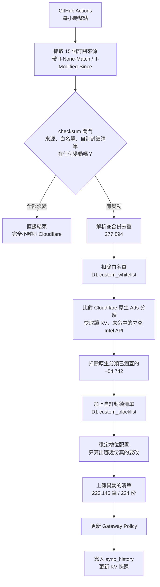

# cloudflare-gateway-block-ads 🛡️

> 用 Cloudflare Zero Trust Gateway 做全網域擋廣告與追蹤器。
> 不必多養一台 Pi-hole，不必在每台裝置上裝東西，換了網路也還在。

**cloudflare-gateway-block-ads** 把 15 個公開的廣告/追蹤器訂閱來源合併成一份去重後的
網域清單，扣掉 Cloudflare 內建分類已經涵蓋的部分，再上傳成 Cloudflare Gateway 的
DNS 封鎖清單。整套跑在 GitHub Actions 上，狀態存在 Cloudflare D1 與 KV，
**不需要任何伺服器**。

目前規模：15 個來源合併出 **277,894** 個網域，扣掉 **6** 個白名單網域與
**54,742** 個已被 Cloudflare 原生分類涵蓋的網域，實際上傳 **223,146** 個網域、
分佈在 **224 份** Gateway 清單。

## 目錄

- [為什麼這樣做](#為什麼這樣做)
- [運作方式](#運作方式)
- [安裝](#安裝)
- [日常操作](#日常操作)
- [疑難排解](#疑難排解)
- [參考資料](#參考資料)

## 為什麼這樣做

### 為什麼是 Gateway 清單，不是 Regex

Cloudflare 的 policy 表達式有 6,500 字元上限。同等規模的網域清單改用 Regex 表示，
需要的 policy 數量會遠超過用清單的做法（公開實測：144K 網域用 Regex 需要 499 條
policy，用清單只要 145 個）。規模一上來就完全不划算。

### 為什麼先讓 Cloudflare 原生分類擋一層

Cloudflare 自己的 Ads 分類（Advertisements + Trackers/Analytics）零維護、自動更新。
先讓它擋掉涵蓋範圍內的網域，我們只上傳它沒涵蓋到的部分 —— 目前這一步就省下
**54,742** 個網域，換到的是在 300 份清單的免費額度內留下更多空間。

> ⚠️ **「網域不在 Gateway 清單裡」不等於「沒被擋」。**
> 那 54,742 個網域是被原生分類擋掉、**刻意不上傳**的，`doubleclick.net` 就是其中之一。
> 只掃清單會得到「查無此網域」的錯誤結論。用 [`manage.sh find`](#診斷某個網域為什麼會或不會被擋)
> 才會把四個來源都查一遍。

### 為什麼 D1 不做即時查詢

DNS 查詢當下的封鎖判斷完全交給 Gateway 自己的清單機制。D1 只在排程同步時被讀寫，
避開「即時查詢外部資料庫、延遲不穩定」的問題。這也表示 D1 掛掉不影響封鎖，
只會讓同步暫時失敗。

### 為什麼 CNAME 分類維持預設

不開啟「忽略 CNAME 域名類別」，保留偵測「用第一方網域偽裝的廣告/追蹤器」的能力。
個案誤判交給白名單處理，不為了少數誤判犧牲整體防護力。

### 已知限制

| 限制 | 說明 |
|---|---|
| 只能做網域層級 | DNS 查詢看不到 URL 路徑，也看不到是哪個 App 發的。來源清單裡的 `\|\|domain.com/path` 或 `$app=` 這類條件會被忽略 |
| 命中即涵蓋子網域 | Gateway 的 DOMAIN 清單命中 `example.com` 時，`ads.example.com` 也會一起被擋。這是特性，也是誤擋的主要來源 |
| 不採用來源自帶的 `@@` 例外 | 交給本專案自己的白名單統一管理，避免不受控的破口 |
| 白名單預設精確比對 | `youtube.com` 不會放行 `ads.youtube.com`。要涵蓋子網域得寫 `*.youtube.com` |

## 運作方式



### 三個關鍵設計

#### 1. checksum 閘門：每小時檢查，但幾乎不做事

排程是每小時整點，但腳本會先比對**各來源解析後輸出**的 sha256。全部沒變動就直接結束，
一次 Cloudflare API 都不會呼叫。

比對的是「解析後輸出」而不是原始位元組，因為很多來源的檔頭帶有時間戳，
每次抓下來的原始內容都不一樣，用原始位元組算 checksum 會永遠都判定為「有變動」。

白名單與自訂封鎖清單的 checksum 也納入閘門 —— 否則你加了白名單卻不會觸發同步。

#### 2. 穩定槽位：移除一個網域只重傳一份清單

每份清單是一個**槽位**，不是連續切片：

| | 連續切片（舊） | 穩定槽位（現行） |
|---|---|---|
| 移除一個網域 | 它之後的每一份都位移一格，全部要重傳 | 只從它所在那份拿掉，留下空缺 |
| 新增一個網域 | 同上 | 優先遞補編號最小的空缺，填滿才開新的 |
| 實測（移除第 ~144,000 位的網域）| 重傳 80 份 / 76 秒 | 重傳 1 份 |
| 實測（新增 7 個網域）| — | 重傳 1 份 / 52 秒 |

成員資料每次都直接向 Cloudflare 讀回，**不另外存一份副本**。Gateway 上的實際內容
就是權威來源：能自我修復（有人手動改過也會被看見），而且同時涵蓋中斷續傳 ——
上次沒傳完的狀態，這次讀到的就是未完成實況，自然會把差額補上。

代價是清單內容會逐漸失去字母序。這對封鎖行為沒有影響，但表示不能再用二分搜尋
定位網域，要用 [`manage.sh find`](#診斷某個網域為什麼會或不會被擋)。

#### 3. 分類快取放 KV，不放 D1 的讀取路徑

`domain_category_cache` 有 46 萬列。原本每次同步都要 `SELECT ... WHERE checked_at >= ?`
把整張表讀出來 —— 這是一次全表掃描，實測讓單日 rowsRead 衝到 5,551,625，
超過 D1 免費版每日 500 萬列的上限。

> **這裡不該加索引。** 索引只在選擇性高、命中列數遠小於總數時才有效；
> 這個查詢在 TTL 內幾乎命中每一列，走索引要先掃 B-Tree 再回表，比全表掃描更貴，
> 而且每次寫入都要多維護一份索引結構（那些也算 Rows Written）。
> 問題不在「怎麼掃」，在於「不該把整張表讀出來」。

改成把快取整份存成 KV 上的一個 gzip blob，讀取時抓這一個物件就好：

| | 改動前 | 改動後 |
|---|---|---|
| 每次同步的 D1 讀取 | 462,890 列 | ≤ 約 136 列 |
| 快照大小 | — | 463,061 列 / 3.54 MiB（KV 單值上限 25 MiB）|

**KV 只是讀取側快取，D1 仍然是權威來源，寫入路徑沒有改變。** KV 回 404、非 200、
內容不是合法 gzip、解壓後是空的、任何一行不符三欄格式 —— 任何一種情況都會退回讀 D1，
所以最壞情況等同沒有這層快取。

> 「約 136 列」是從兩次強制同步的 D1 用量推算出來的**上界**，不是量測到的定值：
> D1 會把 UPSERT 造成的索引查找也算進 `rowsRead`，所以那個數字裡混著寫入端的成本。
> 而且兩次都是強制完整同步，不代表更常見的「checksum 閘門直接略過」那種更便宜的情況。

### 元件

| 元件 | 位置 | 職責 |
|---|---|---|
| 排程 | `.github/workflows/sync.yml` | 每小時觸發；`workflow_dispatch` 可手動觸發並帶參數 |
| 同步主程式 | `sync.sh` | 抓取、解析、合併、比對、上傳、更新 Policy |
| 管理工具 | `manage.sh` | 白名單、自訂封鎖清單、失敗紀錄、網域診斷 |
| 來源設定 | `sources.conf` | 每行 `name\|url\|format` |
| 狀態儲存 | Cloudflare D1 `dns-blocklist-apac` | 7 張表，見[參考資料](#d1-資料表) |
| 讀取快取 | Cloudflare KV `adblock-category-cache` | 分類快取快照，key `category-cache-v1` |
| 封鎖清單 | Cloudflare Gateway Lists | 224 份 `Block ads - NNN`，每份上限 1000 筆 |
| 封鎖規則 | Cloudflare Gateway Policy `Block ads` | `any(dns.domains[*] in $list-uuid) or ...` |

### 配額

| 資源 | 免費額度 | 目前用量 | 保護機制 |
|---|---|---|---|
| D1 每日寫入 | 100,000 列 | 依異動量，通常 < 1,000 | 腳本自訂上限 90,000，超過就把剩下的分類快取延後到隔天補寫 |
| D1 每日讀取 | 5,000,000 列 | 每次同步 ≤ 約 136 列 | KV 快照取代全表掃描 |
| Gateway 清單數 | 300 份 | 224 份 | 原生分類先擋掉 54,742 個網域，壓低上傳量 |
| KV 單值大小 | 25 MiB | 3.54 MiB | 逼近 20 MiB 會示警，超過就放棄寫入並退回讀 D1 |

## 安裝

### 需要準備

1. 一個 Cloudflare 帳戶，並啟用 **Zero Trust**（Gateway）
2. 一個 **D1 資料庫**（本專案用的是 APAC 區的 `dns-blocklist-apac`）
3. 一個 **KV namespace**（本專案用的是 `adblock-category-cache`）
4. 一個 **API Token**，權限如下：

   | 類型 | 權限 | 等級 |
   |---|---|---|
   | Account | Zero Trust | Edit |
   | Account | D1 | Edit |
   | Account | Intel | Read |
   | Account | Workers KV Storage | Edit |

> ⚠️ 這顆 Token 能改你的 Gateway 規則。請**單獨申請一顆**給這個專案用，不要跟其他用途共用。
> 之後如果要補權限，**編輯既有 Token 不會換掉密鑰**，GitHub Secret 不用重設；
> 只有按「Roll」才會換值。

### 設定

Fork 這個 repo，然後到 **Settings → Secrets and variables → Actions** 新增：

| Secret | 值 |
|---|---|
| `CF_ACCOUNT_ID` | 你的 Cloudflare Account ID |
| `CF_API_TOKEN_ADBLOCK` | 上一步申請的 Token |
| `CF_D1_DATABASE_ID` | 你的 D1 資料庫 ID |

> ⚠️ **Fork 之後一定要換掉 `KV_NAMESPACE_ID`。**
> `sync.sh` 設定區裡的預設值是本 repo 自己的 namespace。沿用它配上你自己的 Token，
> 每次讀都會 404、每次寫都會失敗，然後**靜靜地退回讀 D1 全表掃描** —— 封鎖結果仍然
>正確，但每次同步要多讀 46 萬列，下面那張配額表的「約 136 列」對你就不成立。
> 建立自己的 namespace 之後改那一行，或設同名環境變數。

KV namespace ID 不是機密。把 `KV_NAMESPACE_ID` **設成空字串**就會整個停用 KV 快取、
退回讀 D1，功能不受影響（注意是設成空字串；完全不設定的話會套用預設值）。

D1 的七張資料表由 `sync.sh` 的 `ensure_schema()` 在第一次執行時自動建立
（全部是 `CREATE TABLE IF NOT EXISTS`，對既有資料庫是無操作），不需要手動下 SQL。

### 第一次執行

到 Actions 頁面手動觸發一次（**Run workflow**），勾選 **force** 略過 checksum 閘門。
第一次會因為 KV 上還沒有快照而退回讀 D1，並在結束前把快照建起來 —— 這是預期行為。

執行完看 Job Summary 的統計數字是否合理：合併總數、扣除白名單與原生分類後的數量、
最終上傳數量、清單進度。確認沒問題之後就可以放著讓它照排程跑。

## 日常操作

### 白名單與自訂封鎖清單

```bash
export CF_ACCOUNT_ID=你的帳戶ID
export CF_API_TOKEN=你的Token
export D1_DATABASE_ID=你的D1資料庫ID

# 白名單（誤擋時救援用）
./manage.sh whitelist add example.com "這是我常用的服務，誤擋了"
./manage.sh whitelist add "*.googlevideo.com" "CDN 節點主機名會輪替，要用後綴"
./manage.sh whitelist list
./manage.sh whitelist remove example.com

# 自訂封鎖清單（原生分類沒涵蓋、但你想額外擋的）
./manage.sh block add ads.example.com "手動追加"
./manage.sh block list
./manage.sh block remove ads.example.com
```

加完**不會馬上生效**，要等下一次同步。不過白名單的異動會納入 checksum 閘門，
所以下一個整點就會觸發同步，不必手動戳。

### 診斷某個網域為什麼會或不會被擋

```bash
./manage.sh find ads.example.com
```

會把四個可能的來源都查一遍，並回答「會被擋／不會被擋」以及是哪一個造成的：

```
── 診斷 doubleclick.net ──
比對範圍：doubleclick.net

1. 白名單　　　　　　未命中
2. 自訂封鎖清單　　　未命中
3. Cloudflare 原生分類　✅ 命中（查於 2026-08-22）
   → 已被 Cloudflare 內建的 Ads 分類涵蓋，因此「刻意不上傳」到 Gateway 清單，
     但實際上仍然會被擋。這就是為什麼掃不到清單不代表沒被擋。
   掃描 224 份 Gateway 清單中…
4. Gateway 清單　　　不在任何一份清單中

結論：會被擋 —— 來源：Cloudflare 原生 Ads 分類
```

會一併比對所有父網域（因為 DOMAIN 清單命中父網域會連子網域一起擋）。
分類那一項讀 KV 快照，所以整個指令對 D1 的讀取成本只有兩筆小查詢。
掃描 224 份清單約需 **1 分鐘**（Gateway API 會節流，提高平行度沒有用）。

### 手動觸發

Actions → **Sync ad-block lists to Cloudflare Gateway** → **Run workflow**：

| 輸入 | 作用 | 什麼時候用 |
|---|---|---|
| `force` | 略過 checksum 閘門，強制完整同步 | 想立刻套用異動，或懷疑狀態不同步 |
| `rebuild_cache` | 略過 KV 快照，從 D1 重讀並重建 | 日誌顯示快照解壓失敗或格式不符 |

### 自訂訂閱來源

編輯 `sources.conf`，每行 `name|url|format`，`format` 支援：

| format | 說明 |
|---|---|
| `domains` | 純網域清單，一行一個 |
| `adblock` | AdBlock Plus / uBlock Origin 語法 |
| `hosts` | hosts 檔格式 |

新來源抓取或解析失敗只會留下警告，不會讓整次同步失敗，其他來源照樣合併上傳。

> ⚠️ **AdBlock 語法不等於 DNS 封鎖。** 解析器會丟棄所有帶 `=` 的修飾詞規則
> （`$removeparam=`、`$redirect=`、`$domain=`、`$csp=` 等）—— 那些是「限定套用範圍」
> 或「改寫請求內容」，不代表要在 DNS 層擋掉整個網域。
> 這裡踩過三次坑，最嚴重的一次是 `||youtube.com^$removeparam=pp` 讓 YouTube 全站被擋。

## 疑難排解

| 症狀 | 先檢查 |
|---|---|
| 加了白名單但還是被擋 | `sync_history` 最後一次 `run_at` 是否**晚於**你的異動時間。這比程式出錯常見得多 |
| 某網站被誤擋 | `./manage.sh find <domain>` 找出是哪一個來源造成的，再決定加白名單還是修解析器 |
| 掃不到網域但確定被擋 | 十之八九是被 Cloudflare 原生分類擋掉的（目前 54,742 筆），`find` 會告訴你 |
| 排程一直「略過」 | 正常。來源沒變動就不做事。要強制執行請用 `force` |
| 清單上傳失敗 | 目前只會在執行日誌裡留 `⚠` 警告，看 Actions 的日誌。`manage.sh failures` 讀的 `upload_failures` 表**目前沒有任何東西在寫入**（寫入端在穩定槽位改版時一併被移除了），所以會回空 |
| 日誌收折標記錯位 | workflow 必須是 `./sync.sh 2>&1`。`log`/`warn` 與 `::group::` 都寫 stderr，不合流會因緩衝差異而錯位 |

**設計原則：盡力而為，不要跳錯。** `sync.sh` 用 `set -uo pipefail` 但**刻意不用 `-e`**。
單一來源抓取失敗、D1 一時連不上、某份清單上傳失敗 —— 都只留警告然後繼續，
不會讓整次同步中斷。清單上傳失敗時會**保留 Gateway 上的舊內容並繼續引用**，
避免把那 1000 個網域整批放行。

會主動中止（`exit 1`）的情況有四種，共通點都是「再走下去會弄壞線上狀態」：
合併後的來源清單是空的、最終要上傳的清單是空的、上傳後沒有任何一份有效清單、
以及 Policy 更新失敗。前三種通常代表所有來源都抓取失敗，這時中止比清空 Gateway 清單安全。

## 參考資料

### 檔案結構

```
sync.sh                      同步主程式
manage.sh                    白名單 / 自訂封鎖清單 / 診斷工具
sources.conf                 訂閱來源設定
.github/workflows/sync.yml   排程 workflow
```

### D1 資料表

| 表 | 用途 |
|---|---|
| `custom_whitelist` | 白名單。支援 `*.suffix` 後綴寫法 |
| `custom_blocklist` | 自訂封鎖清單，強制納入上傳 |
| `domain_category_cache` | Cloudflare Intel 分類查詢結果，權威來源（讀取走 KV 快照）|
| `sync_state` | 各來源的 checksum、ETag、Last-Modified，以及延後補寫的筆數 |
| `d1_daily_writes` | 每日（UTC）寫入用量，跨執行累計 |
| `sync_history` | 每次同步的統計數字 |
| `upload_failures` | 清單上傳失敗的診斷紀錄。**目前沒有寫入端**，寫入邏輯在穩定槽位改版時被移除，尚未補回 |

### 主要設定常數（`sync.sh`）

| 常數 | 值 | 說明 |
|---|---|---|
| `LIST_CHUNK_SIZE` | 1000 | 每份 Gateway 清單的上限，Cloudflare 規定 |
| `CACHE_TTL_DAYS` | 90 | 分類快取存活天數。曾經是 30，但 46 萬列幾乎同時建立，會集體同時過期 |
| `D1_DAILY_WRITE_BUDGET` | 90,000 | 低於官方的 100,000，留餘裕給其他表 |
| `BULK_BATCH_SIZE` | 650 | Intel 批次查詢筆數。實測上限約 700，再高會被 431 拒絕 |
| `PARALLEL_WORKERS` | 15 | 分類查詢的平行工作數 |
| `SLOT_FETCH_PARALLEL` | 10 | 讀回既有清單成員的平行度 |

### 執行環境需求

`bash`、`curl`、`jq`、`gzip`、`coreutils`（`sort` / `comm` / `awk` / `sed` 等）。
`ubuntu-24.04` runner 全部內建，不需要額外安裝步驟，也不需要 Python。

### 設計參考

- Regex 規模化不可行的實測數據（CJ Scrofani：144K 網域用 Regex 需 499 條 policy，用清單只需 145 個）
- 白名單優先於封鎖清單的機制設計（[luxysiv/Cloudflare-Gateway-DNS-Filter](https://github.com/luxysiv/Cloudflare-Gateway-DNS-Filter)）
- 300 份清單免費額度上限的處理方式（多個同類專案的共通做法）

## 授權

[MIT](./LICENSE)
